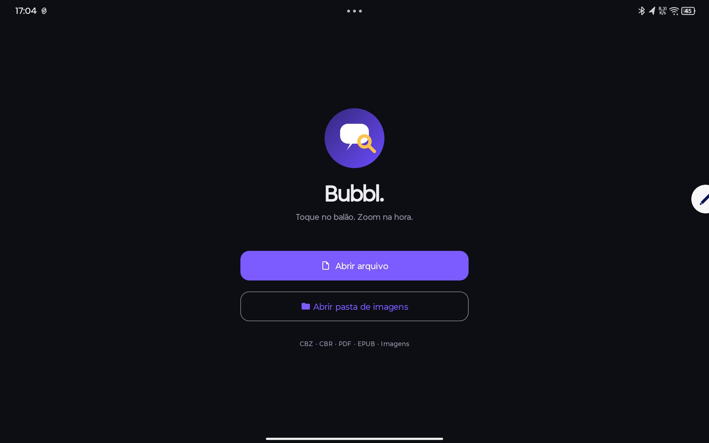

<div align="center">

# Bubbl.

**Leitor de mangás e quadrinhos para Android — toque no balão, zoom na hora.**

[](https://github.com/walterfr/bubbl/actions/workflows/android.yml)




</div>

---

## O que é

Bubbl. abre arquivos de quadrinho/mangá e deixa a leitura fluida numa ideia central: **um toque na página dá zoom automático ancorado no ponto tocado** — o balão de diálogo que você quer ler. Toca de novo, volta pro enquadramento da página. Sem menus, sem pinça.

## Recursos

- **Zoom no toque** ancorado no ponto (o balão), com animação suave.
- **Tiling de imagens grandes** — páginas de mangá em alta resolução sem estourar memória.
- **Leitura imersiva** — barras de sistema escondidas, chrome translúcido (voltar, contador, slider de página).
- **Vários formatos** num pipeline único.
- **Material 3** (tema escuro), ícone adaptativo vetorial.

## Formatos suportados

| Formato | Como é lido |
|---|---|
| **CBZ / ZIP** | Imagens no arquivo (`java.util.zip`) |
| **CBR / RAR** | [junrar](https://github.com/junrar/junrar) |
| **PDF** | `PdfRenderer` nativo do Android (sem lib) |
| **EPUB** (fixed-layout) | Imagens do container, ordem por nome |
| **Imagens** | JPG · PNG · WEBP · GIF · BMP |
| **Pasta** | Seletor de árvore (SAF / `DocumentFile`) |

Tudo é convertido numa **lista única de páginas** (`Uri`), então o visualizador trata todo formato igual. Detalhes em [docs/ARCHITECTURE.md](docs/ARCHITECTURE.md).

## Gestos

| Gesto | Ação |
|---|---|
| **Toque** | Amplia o balão sob o dedo (no formato dele) |
| **Toque duplo** | Zoom normal do documento |
| **Pinça** | Zoom livre |
| **Arrastar** | Pan (quando com zoom) |
| **Deslizar horizontal** | Trocar de página |
| **Slider inferior** | Pular para qualquer página |

## Build & Run

Requisitos: **JDK 17**, Android SDK (platform 34), um dispositivo/emulador **Android 8.0+ (API 26)**.

```bash
git clone https://github.com/walterfr/bubbl.git
cd bubbl
./gradlew installDebug     # compila e instala no dispositivo conectado
```

Só gerar o APK:

```bash
./gradlew assembleDebug    # app/build/outputs/apk/debug/app-debug.apk
```

Rodar os testes:

```bash
./gradlew test
```

> No Windows, use `gradlew.bat`. Ou abra a pasta no **Android Studio** (Hedgehog+) e rode a config `app`.

## Stack

- **Kotlin** · Android Views · Material 3
- [SubsamplingScaleImageView](https://github.com/davemorrissey/subsampling-scale-image-view) — pan/zoom + tiling
- ViewPager2 · Coroutines · DocumentFile
- `PdfRenderer` (nativo) · junrar (CBR)

## Roadmap

- [x] Zoom no balão: **toque único** isola o balão (flood-fill) e infla ~2x no seu formato; **toque duplo** dá o zoom normal do documento.
- [ ] Detecção robusta de balão (OpenCV ou modelo ML) para os casos que a heurística erra.
- [ ] Direção de leitura direita→esquerda (mangá).
- [ ] Biblioteca / histórico / marcadores / continuar de onde parou.
- [ ] Carga de páginas sob demanda (hoje extrai o livro inteiro pro cache ao abrir).
- [ ] EPUB baseado em texto (parse de OPF/spine + render HTML).

Veja limitações detalhadas em [docs/ARCHITECTURE.md](docs/ARCHITECTURE.md#limitações-conhecidas).

## Contribuindo

PRs e issues são bem-vindos. Leia [CONTRIBUTING.md](CONTRIBUTING.md).

## Licença

[MIT](LICENSE) © Walter Rebouças
